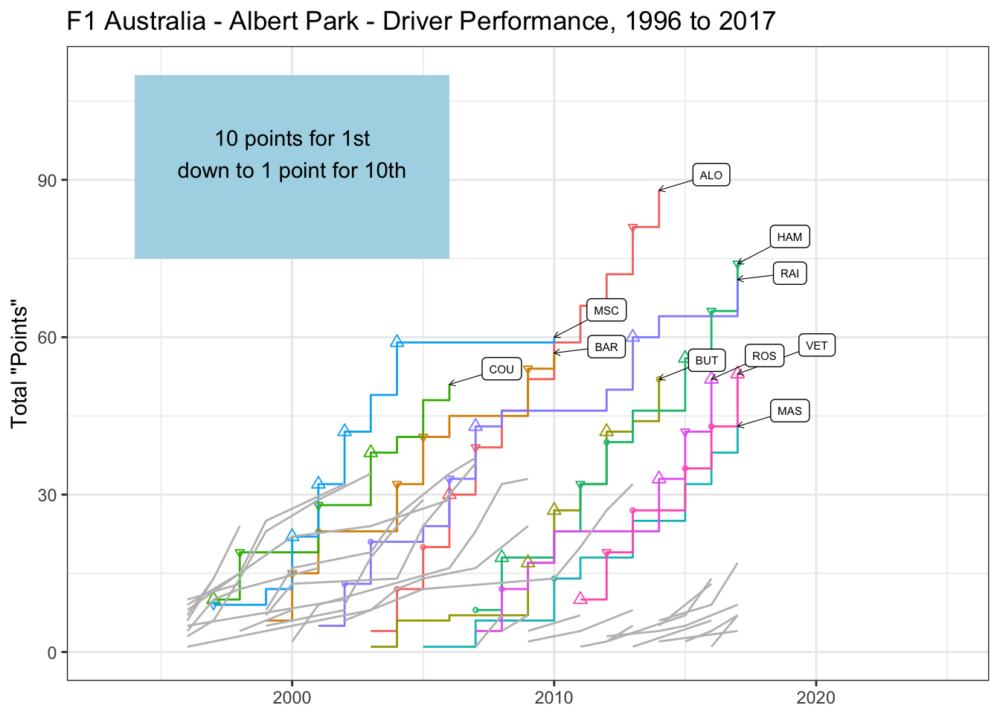

## Driver Performance:

The driver circuit performance chart shows the relative performance of drivers at the same circuit over the years.

Because point schemes may have change over the period in which the circuit has been used, a nominal scoring system is used: drivers finishing in first are given a notional ten points, down to one point for the driver in tenth position.

The chart highlights the top 10 drivers at the circuit over time, along with their podium finishes.

<!-- -->
