# Race Report - Battlemaps

O    |    6 | Wheel    |   24 | 23: 88.805 (16) |
|   17 |     20 | MAG    |    5 | Wheel    |   22 | 21: 89.534 (17) |
|   18 |     10 | GAS    |   20 | Engine   |   13 | 13: 90.649 (18) |
|   19 |      9 | ERI    |   17 | Steering |    5 | 4: 92.21 (19)   |
|   20 |     35 | SIR    |   19 | Brakes   |    4 | 3: 92.573 (20)  |

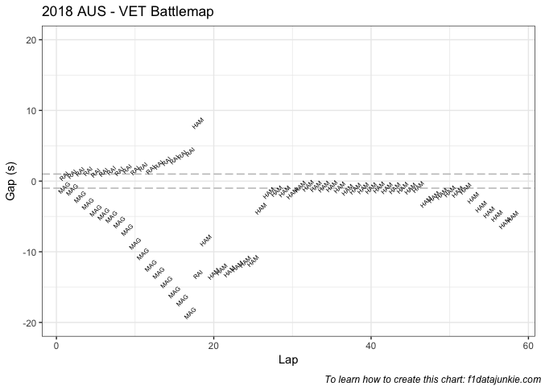<!-- -->   

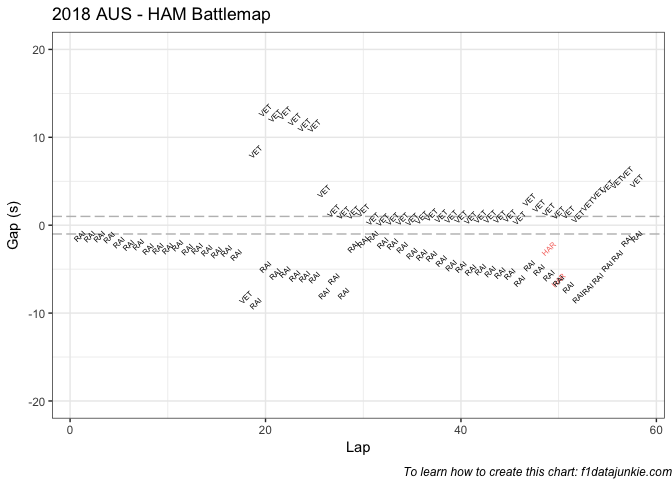<!-- -->

    
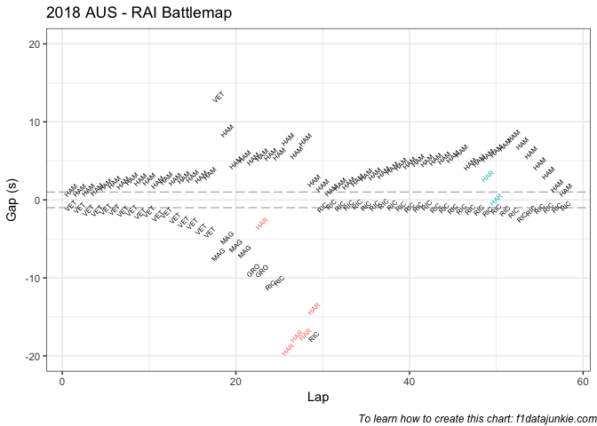<!-- -->

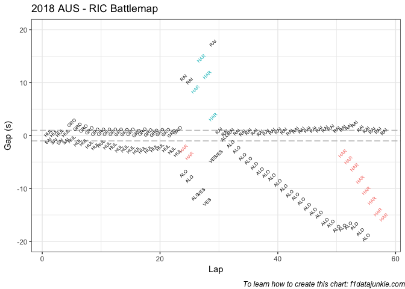<!-- -->

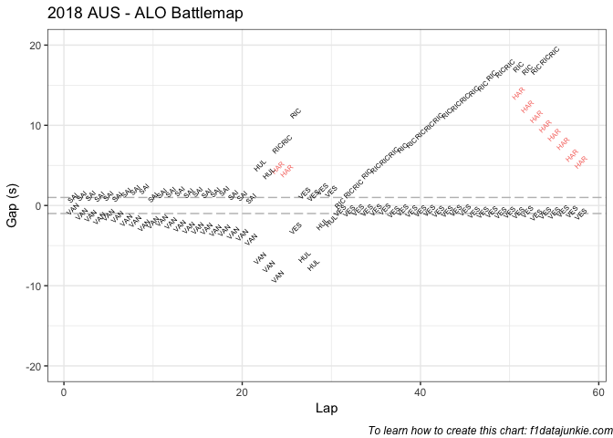<!-- -->

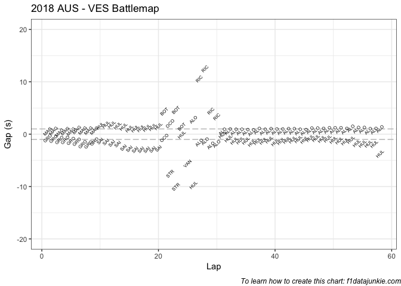<!-- -->

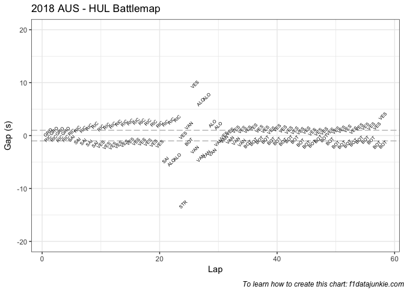<!-- -->

 
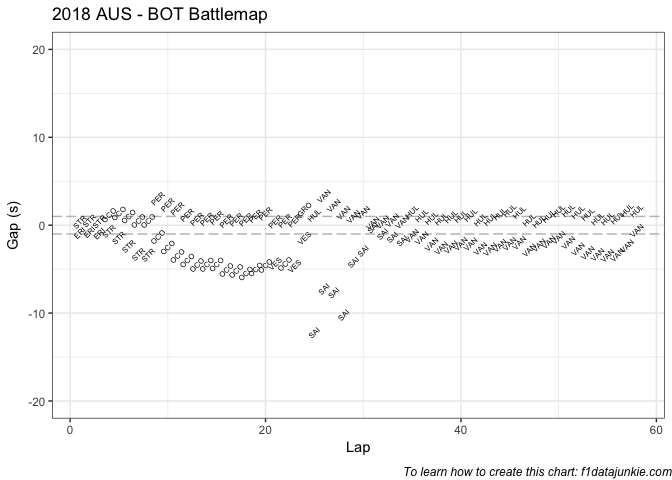<!-- -->

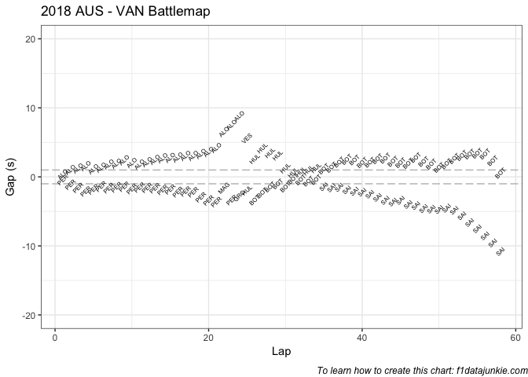<!-- -->

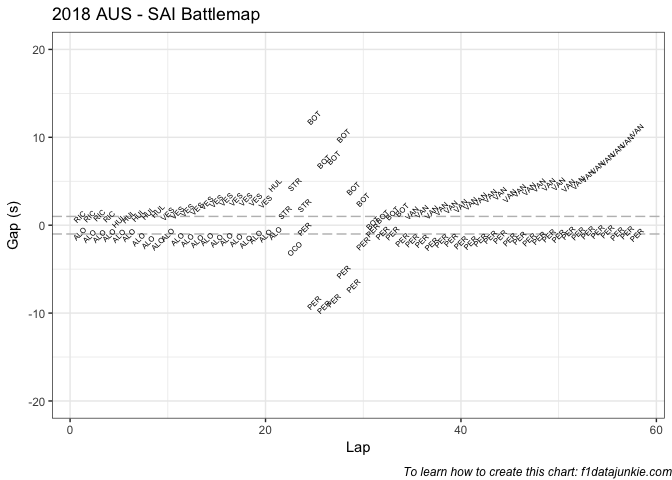<!-- -->

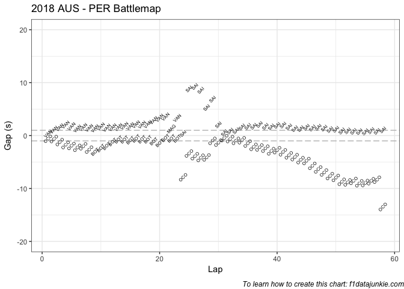<!-- -->

  
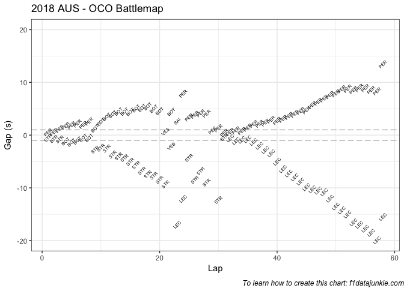<!-- -->

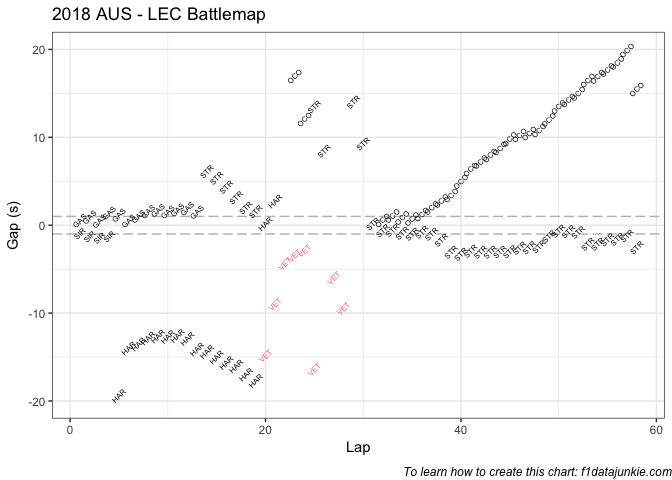<!-- -->

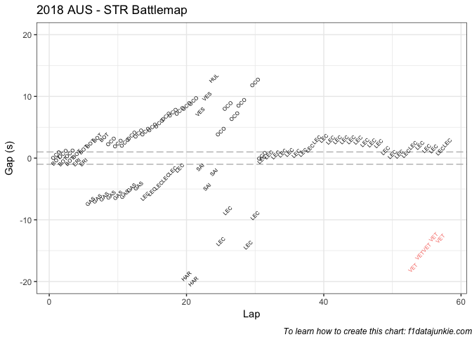<!-- -->

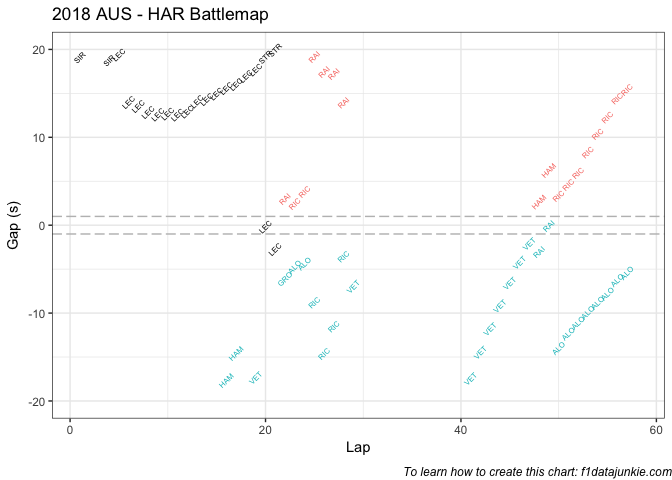<!-- -->
 
 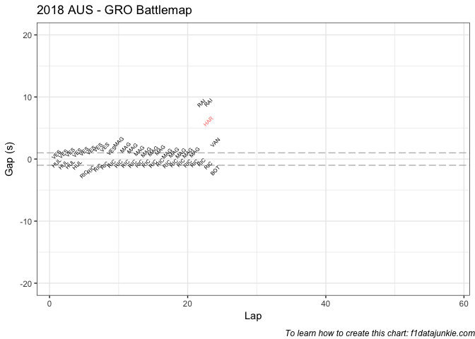<!-- -->

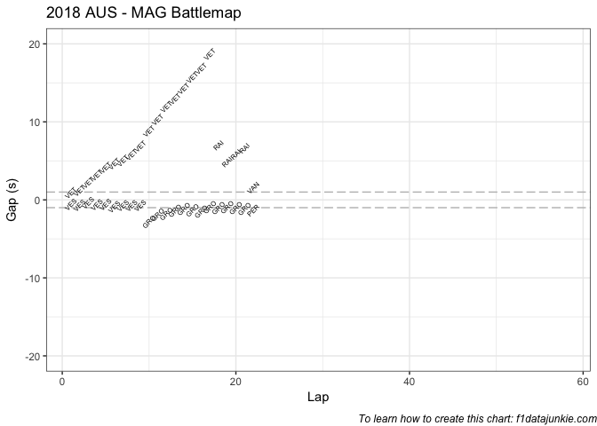<!-- -->

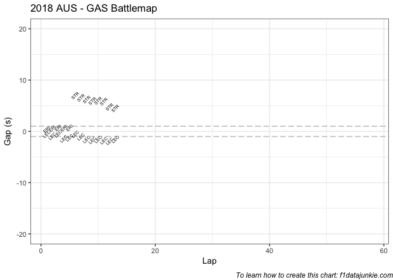<!-- -->

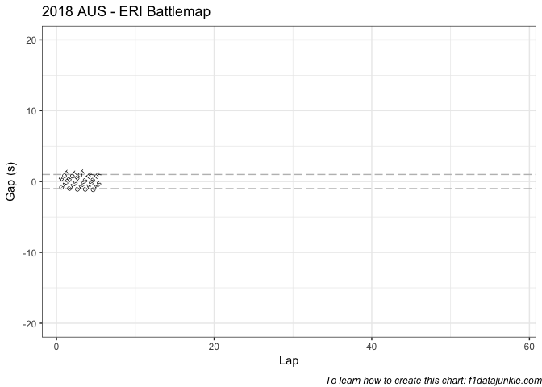<!-- -->
   
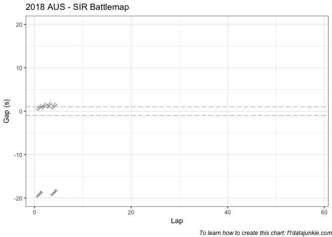<!-- -->

-----

This website is unofficial and is not associated in any way with the
Formula 1 companies. F1, FORMULA ONE, FORMULA 1, FIA FORMULA ONE WORLD
CHAMPIONSHIP, GRAND PRIX and related marks are trade marks of Formula
One Licensing B.V.
