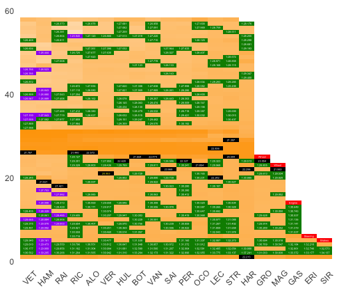
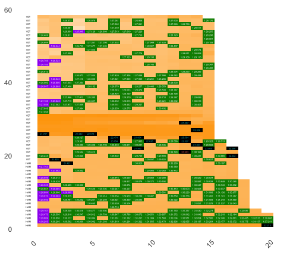
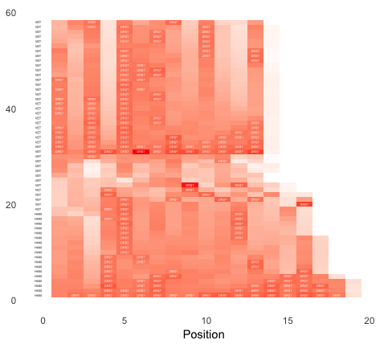
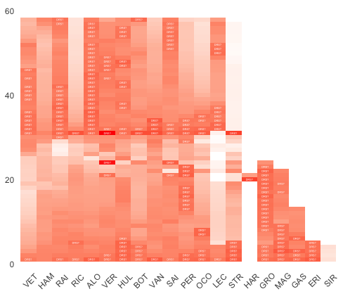

# Lap Analysis

Charts based on analysing laptimes.

## Laptime by driver

Heatmap showing relative laptimes of each river over the course of the race highlighting purple (fastest lap to date), green (driver personal best) and pit stop laps.
 
<!-- -->

## Laptime by position

The *laptime by driver* hides the actual order in which the laptimes were recored. We can order the chart by race position at the end of each lap to try to identify battles more clearly, as well as the order in which times are recorded. The y-axis label identifies the leader at the end of each lap.

<!-- -->

## Battlesearch

The battlesearch heatmap shows that one car is closely fllowed by another. *DRS?* indicators show the the car behind is with 1 second at the end of the lap.

<!-- -->

## Driver Battlesearch

The driver battlesearch heatmap shows how closely a driver is being pursued by the car behind. *DRS?* indicators show the the car behind is with 1 second at the end of the lap.

<!-- -->

