# Track Concordance

F1 track concordance charts

  
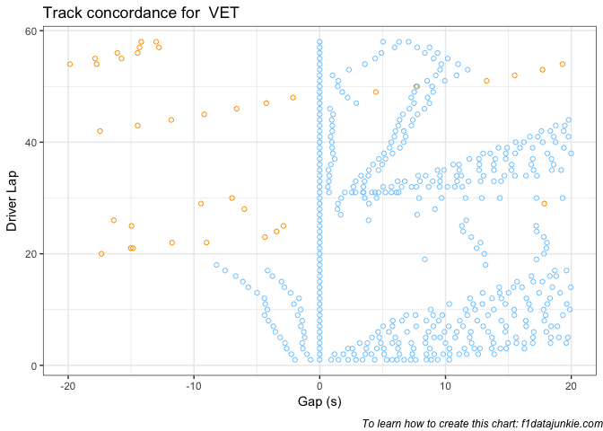<!-- -->
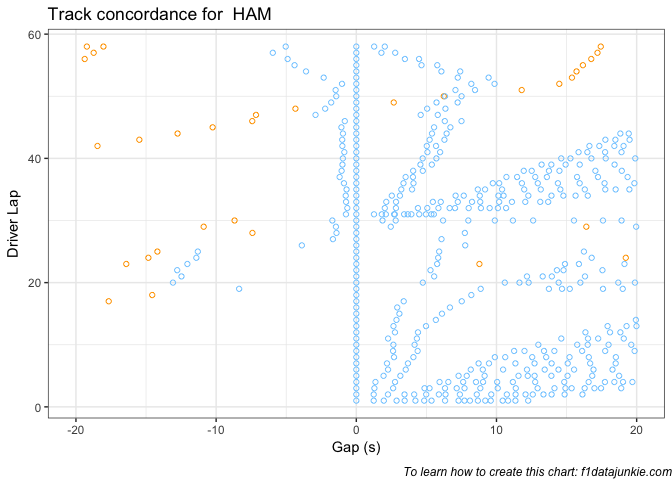<!-- -->
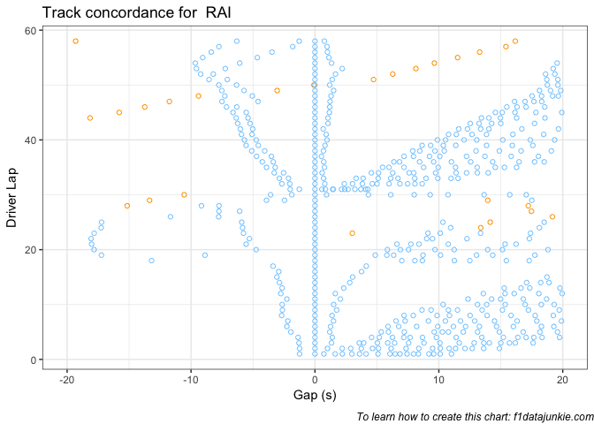<!-- -->
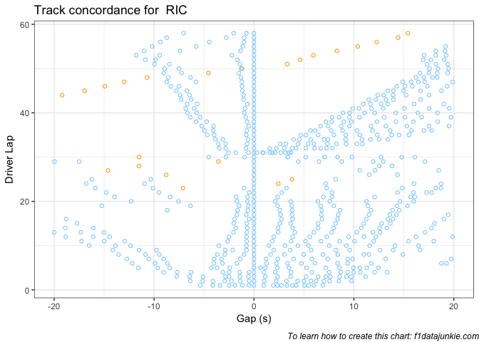<!-- -->
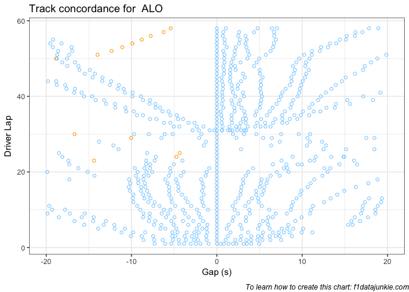<!-- -->
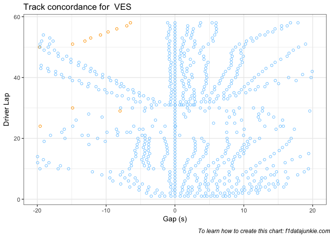<!-- -->
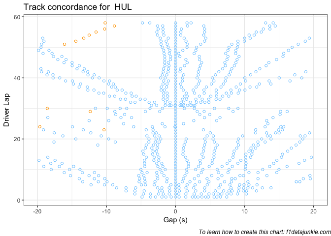<!-- -->
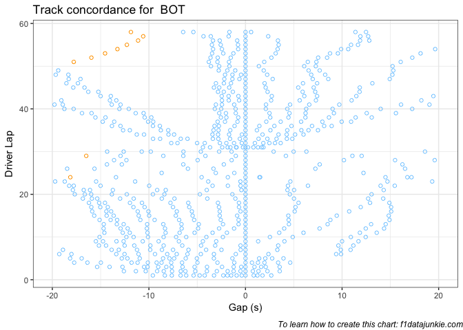<!-- -->
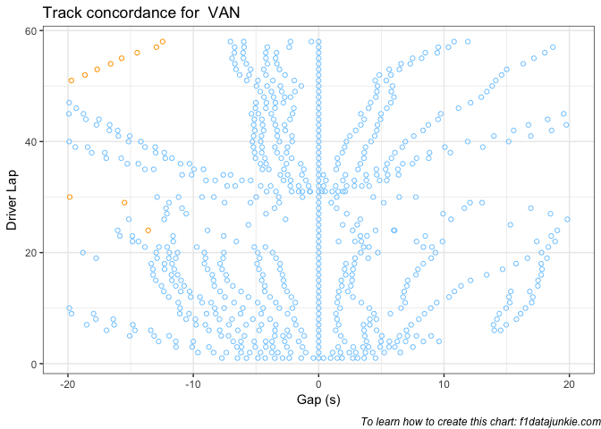<!-- -->
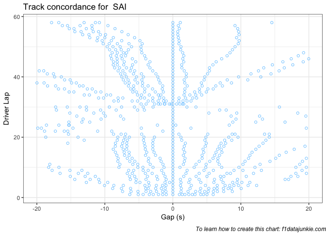<!-- -->
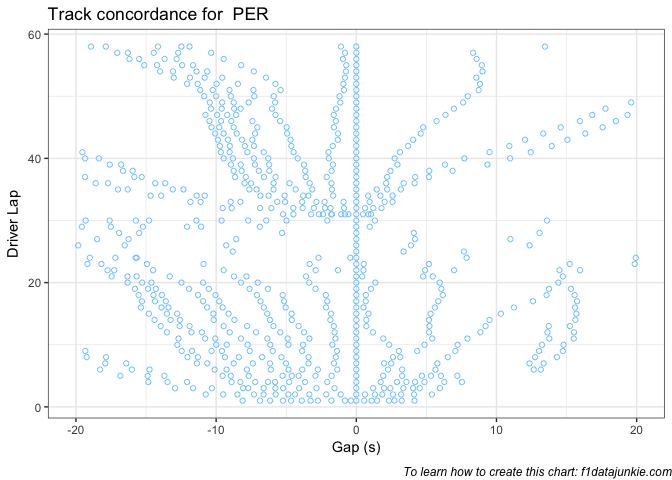<!-- -->
<!-- -->
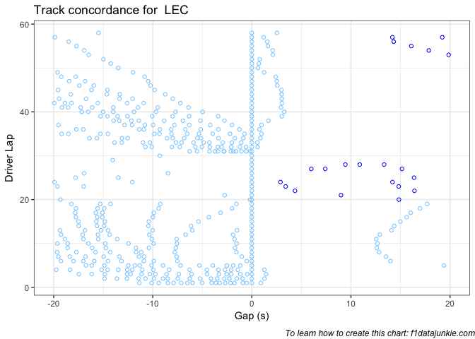<!-- -->
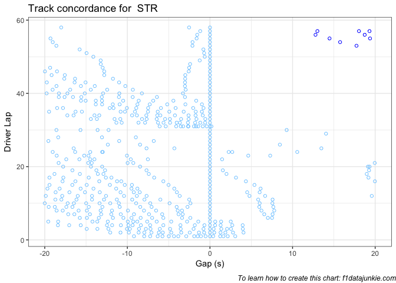<!-- -->
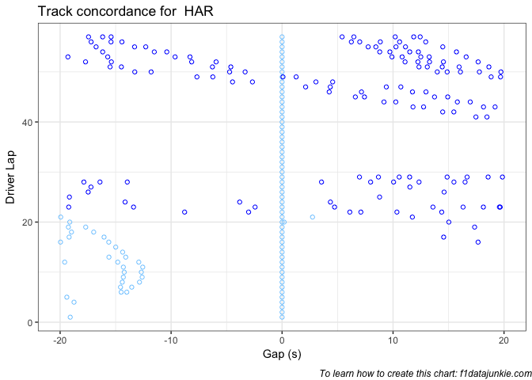<!-- -->
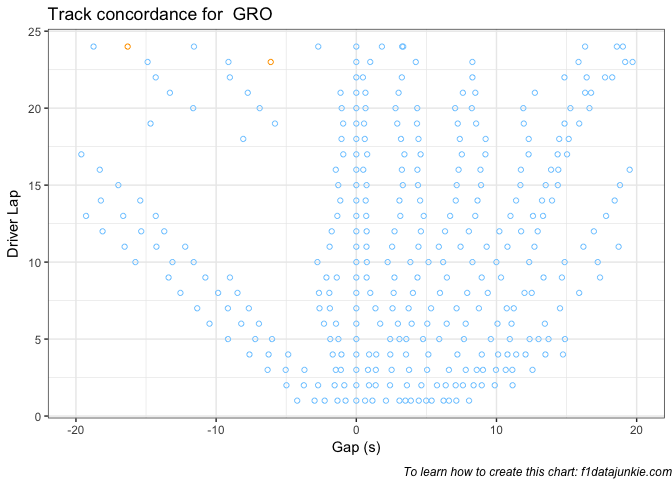<!-- -->
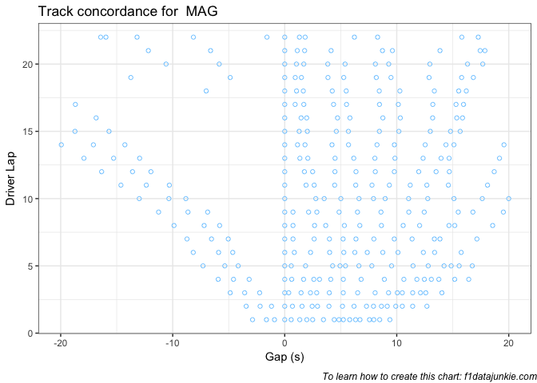<!-- -->
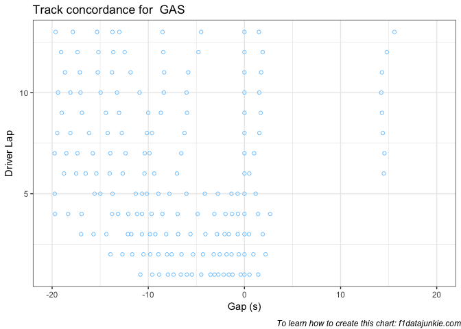<!-- -->
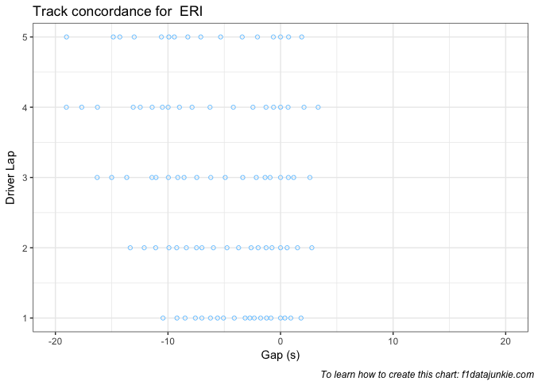<!-- -->
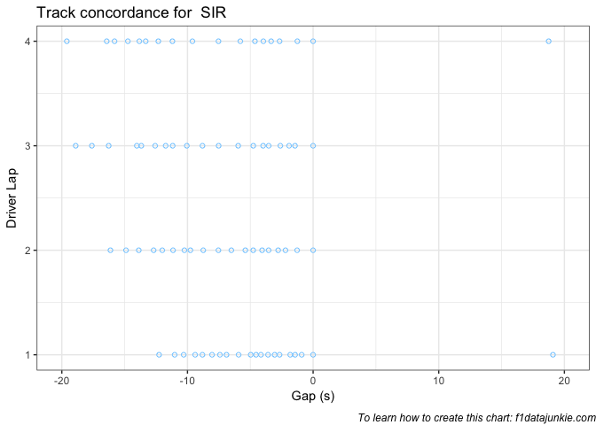<!-- -->

-----

This website is unofficial and is not associated in any way with the
Formula 1 companies. F1, FORMULA ONE, FORMULA 1, FIA FORMULA ONE WORLD
CHAMPIONSHIP, GRAND PRIX and related marks are trade marks of Formula
One Licensing B.V.
